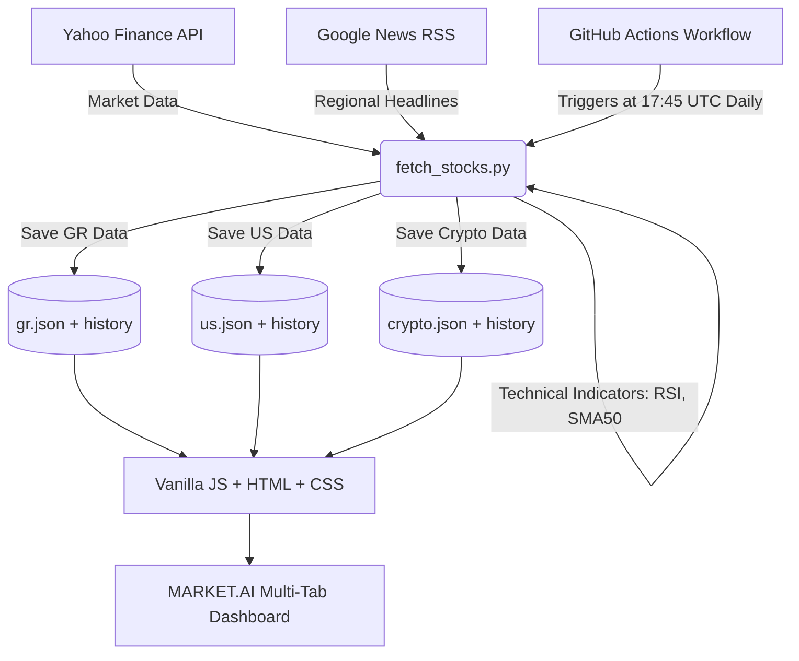

# 🌍 MARKET.AI | Global Markets & Crypto Dashboard (V5.0)

-blueviolet?style=for-the-badge)


Το **MARKET.AI** (πρώην ATHEX.AI) είναι το απόλυτο, πλήρως αυτοματοποιημένο εργαλείο ανάλυσης για τις Παγκόσμιες Αγορές. Σχεδιασμένο για να φέρει "θεσμικού επιπέδου" πληροφορίες στην οθόνη του απλού επενδυτή, συνδυάζοντας την αυστηρή Τεχνική Ανάλυση με τη Θεμελιώδη αξιολόγηση και την Τεχνητή Νοημοσύνη (NLP). 

Μέσα από ένα ενιαίο περιβάλλον, καλύπτει τρεις τεράστιες αγορές:
1. 🇬🇷 **Ελληνικό Χρηματιστήριο (ATHEX)**
2. 🇺🇸 **Wall Street (US Tech)**
3. 🪙 **Κρυπτονομίσματα (Crypto)**

🔗 **[Δείτε το Live Demo (Ενημερώνεται καθημερινά)](https://karidasd.github.io/greek-stocks-ai/)**

---

## 🔥 Βασικά Χαρακτηριστικά (Core Features)

### 1. 🎛️ Multi-Market Switcher (Ακαριαία Εναλλαγή Αγορών)
Το Dashboard διαθέτει διακόπτες (Tabs) στο πάνω μέρος. Πατώντας σε μια αγορά, ολόκληρη η σελίδα – οι ειδήσεις, οι δείκτες, τα SOTD, το Fear & Greed – προσαρμόζονται ακαριαία χωρίς να χρειάζεται ανανέωση της σελίδας!

### 2. 🧠 AI "Stock of the Day" & Track Record
Για **κάθε αγορά ξεχωριστά**, ο αλγόριθμος υπολογίζει ένα σύνθετο σκορ (βάσει RSI, P/E, Μερίσματος και Τάσης) και αναδεικνύει την κορυφαία επιλογή της ημέρας (SOTD). Το σύστημα διατηρεί τρία ανεξάρτητα αρχεία ιστορικού και παρακολουθεί καθημερινά το **Ποσοστό Επιτυχίας (Win Rate %)** των προβλέψεών του ανά αγορά!

### 3. 🌟 Αναγνώριση Μοτίβων (Pattern Recognition)
Το σύστημα κατεβάζει ιστορικό δεδομένων 1 έτους και ανιχνεύει αυτόματα: 
- **Golden Cross** 🌟 (Ο SMA-50 περνάει πάνω από τον SMA-200)
- **Death Cross** 💀 (Σήμα τεράστιας πτώσης)
- **Volume Breakouts** 🔥 (Όγκος μεγαλύτερος κατά 150% του μέσου όρου).

### 4. 📰 Ζωντανή Ανάλυση Ειδήσεων (Market Sentiment)
Το Ticker Tape στην κορυφή της οθόνης παρουσιάζει τις **Top 5 Οικονομικές Ειδήσεις** της αγοράς που παρακολουθείτε (π.χ. αναζητά Ελληνικές ειδήσεις στο ATHEX, Αγγλικές ειδήσεις για Tech & Crypto). Στο παρασκήνιο, η Python περνάει τους τίτλους από το νευρωνικό δίκτυο `VADER` και εξάγει το **Sentiment Score**.

### 5. 🧭 Δείκτης Φόβου και Απληστίας (Fear & Greed Index)
Κάθε αγορά έχει το δικό της ξεχωριστό πολύχρωμο "κοντέρ" που μετράει το κλίμα του συγκεκριμένου οικοσυστήματος, συνδυάζοντας τον μέσο όρο των δεικτών RSI με το συνολικό Market Sentiment των ειδήσεων.

### 6. 🏦 Θεμελιώδη Μεγέθη & Ημερολόγιο
- Αυτόματη άντληση **P/E Ratio** και **Dividend Yield** (Μερίσματος) για τις μετοχές.
- **Event Calendar**: Ειδοποιεί με 🔔 αν επίκειται Αποκοπή Μερίσματος τις επόμενες 30 ημέρες.
- *(Αυτά αποκρύπτονται έξυπνα από το UI στην αγορά των Crypto, όπου δεν έχουν εφαρμογή).*

---

## 🏗️ Αρχιτεκτονική Συστήματος



Το project αποτελεί ένα τέλειο παράδειγμα **Serverless Architecture**. Η "βαριά δουλειά" γίνεται 1 φορά την ημέρα (για όλες τις αγορές) από τους Servers του GitHub. Τα αποτελέσματα αποθηκεύονται σε στατικά JSON αρχεία, τα οποία φορτώνονται ακαριαία από τον browser μέσω **GitHub Pages**.

---

## 🚀 Οδηγίες Τοπικής Εκτέλεσης (Local Setup)

Αν θέλετε να τρέξετε τον κώδικα στον υπολογιστή σας:

1. **Κάντε Clone το repository**:
   ```bash
   git clone https://github.com/karidasd/greek-stocks-ai.git
   cd greek-stocks-ai
   ```

2. **Εγκαταστήστε τα Dependencies**:
   ```bash
   pip install -r requirements.txt
   ```

3. **Εκτελέστε τον Αλγόριθμο AI**:
   ```bash
   python scripts/fetch_stocks.py
   ```
   *Το script θα σαρώσει και τις 3 αγορές και θα φτιάξει τον φάκελο `data` με τα 6 παραγόμενα JSON.*

4. **Δείτε το Dashboard**:
   Απλώς ανοίξτε το `index.html` στον browser σας (ή τρέξτε ένα τοπικό Live Server).

---

## 💡 About the Project (Το Όραμα)
Το **MARKET.AI** γεννήθηκε από την ανάγκη εκδημοκρατισμού των θεσμικών χρηματοοικονομικών εργαλείων. Σκοπός του project είναι να αποδείξει πώς σύγχρονες τεχνολογίες (Τεχνητή Νοημοσύνη, Επεξεργασία Φυσικής Γλώσσας και Serverless Αυτοματισμοί) μπορούν να προσφέρουν σε κάθε μικροεπενδυτή εργαλεία τα οποία παραδοσιακά κοστίζουν χιλιάδες ευρώ σε μηνιαίες συνδρομές τερματικών (τύπου Bloomberg Terminal). Είναι ανοιχτού κώδικα, ταχύτατο και σχεδιασμένο με γνώμονα τη διαφάνεια.

---

## ⚖️ Αποποίηση Ευθυνών (Legal Disclaimer)

Το παρόν σύστημα (MARKET.AI) και ο πηγαίος κώδικάς του αποτελούν **αποκλειστικά εκπαιδευτικό και ερευνητικό πείραμα** επάνω στην αλγοριθμική ανάλυση και την τεχνητή νοημοσύνη (NLP). 

**Σε καμία περίπτωση δεν αποτελεί επενδυτική συμβουλή**, προτροπή, ή σύσταση αγοράς/πώλησης χρηματοοικονομικών προϊόντων. Τα δεδομένα αντλούνται από δωρεάν πηγές τρίτων (Yahoo Finance, Google News) και ενδέχεται να είναι ελλιπή, καθυστερημένα, ή εντελώς λανθασμένα. Οι δημιουργοί του έργου είναι δημόσιοι υπάλληλοι/ερευνητές και δεν φέρουν απολύτως **καμία νομική ή οικονομική ευθύνη** για ενδεχόμενες απώλειες κεφαλαίου ή λανθασμένες επενδυτικές αποφάσεις των χρηστών. **Επενδύστε με δική σας ευθύνη.**
