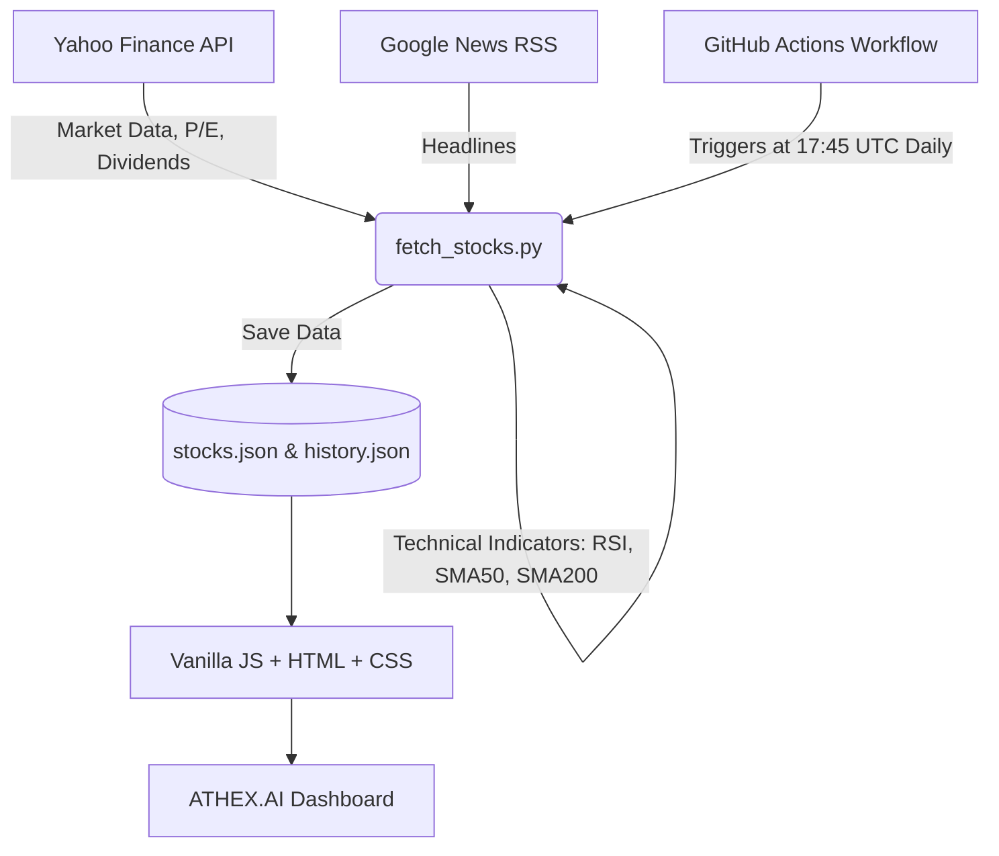

# 🏛️ ATHEX.AI | Institutional Grade Greek Stocks Dashboard (V4.0)

-blueviolet?style=for-the-badge)


Το **ATHEX.AI** είναι το απόλυτο, πλήρως αυτοματοποιημένο εργαλείο ανάλυσης για το **Ελληνικό Χρηματιστήριο (ΧΑΑ)**. Σχεδιασμένο για να φέρει "θεσμικού επιπέδου" πληροφορίες στην οθόνη του απλού επενδυτή, συνδυάζοντας την αυστηρή Τεχνική Ανάλυση με τη Θεμελιώδη αξιολόγηση και την Τεχνητή Νοημοσύνη (NLP).

🔗 **[Δείτε το Live Demo (Ενημερώνεται καθημερινά)](https://karidasd.github.io/greek-stocks-ai/)**

---

## 🔥 Βασικά Χαρακτηριστικά (Core Features)

### 1. 🧠 AI "Stock of the Day" & Track Record
Κάθε μέρα, ο αλγόριθμος υπολογίζει ένα σύνθετο σκορ (βάσει RSI, P/E, Μερίσματος και Τάσης) και αναδεικνύει την κορυφαία επιλογή της ημέρας (SOTD). Το σύστημα διατηρεί κρυφή μνήμη (`history.json`) και παρακολουθεί καθημερινά το **Ποσοστό Επιτυχίας (Win Rate %)** των προβλέψεών του!

### 2. 🌟 Αναγνώριση Μοτίβων (Pattern Recognition)
Το σύστημα δεν κοιτάει απλώς τιμές. Κατεβάζει ιστορικό δεδομένων 1 ολόκληρου έτους και ανιχνεύει αυτόματα το "Ιερό Δισκοπότηρο" των Traders: 
- **Golden Cross** 🌟 (Ο SMA-50 περνάει πάνω από τον SMA-200)
- **Death Cross** 💀 (Σήμα τεράστιας πτώσης)
- **Volume Breakouts** 🔥 (Όγκος μεγαλύτερος κατά 150% του μέσου όρου 20 ημερών).

### 3. 📰 Ζωντανή Ανάλυση Ειδήσεων (Market Sentiment)
Το Ticker Tape (Marquee) στην κορυφή της οθόνης παρουσιάζει σε πραγματικό χρόνο τις **Top 5 Οικονομικές Ειδήσεις**. Στο παρασκήνιο, η Python τις μεταφράζει ακαριαία, τις περνάει από το νευρωνικό δίκτυο `VADER` και βγάζει το **Sentiment Score** (Bullish / Bearish / Neutral) για κάθε μετοχή.

### 4. 🧭 Δείκτης Φόβου και Απληστίας (Fear & Greed Index)
Ένα εντυπωσιακό πολύχρωμο "κοντέρ" που μετράει το κλίμα **ολόκληρου του Χρηματιστηρίου**. Υπολογίζεται μέσω ενός πολύπλοκου αλγόριθμου που συγκρίνει τον μέσο όρο των δεικτών RSI με το συνολικό Market Sentiment των ειδήσεων.

### 5. 🏦 Θεμελιώδη Μεγέθη & Ημερολόγιο (Fundamentals & Calendar)
- Αυτόματη άντληση του **P/E Ratio** για να ξέρετε αν η μετοχή είναι υποτιμημένη.
- **Μερισματική Απόδοση (Dividend Yield)** (Επισημαίνεται με χρυσό Badge 💰).
- **Event Calendar**: Σας ειδοποιεί με 🔔 αν επίκειται Αποκοπή Μερίσματος τις επόμενες 30 ημέρες!

---

## 🏗️ Αρχιτεκτονική Συστήματος



Το project αποτελεί ένα τέλειο παράδειγμα **Serverless Architecture**. Η "βαριά δουλειά" γίνεται 1 φορά την ημέρα από τους Servers του GitHub. Τα αποτελέσματα αποθηκεύονται σε στατικά JSON αρχεία, τα οποία σερβίρονται δωρεάν μέσω **GitHub Pages**.

---

## 🚀 Οδηγίες Τοπικής Εκτέλεσης (Local Setup)

Αν θέλετε να τρέξετε ή να βελτιώσετε τον κώδικα στον υπολογιστή σας:

1. **Κάντε Clone το repository**:
   ```bash
   git clone https://github.com/karidasd/greek-stocks-ai.git
   cd greek-stocks-ai
   ```

2. **Εγκαταστήστε τα Dependencies**:
   (Προτείνεται η χρήση virtual environment)
   ```bash
   pip install -r requirements.txt
   ```

3. **Εκτελέστε τον Αλγόριθμο AI**:
   ```bash
   python scripts/fetch_stocks.py
   ```
   *Το script θα σαρώσει την αγορά και θα φτιάξει τον φάκελο `data` με τα αποτελέσματα.*

4. **Δείτε το Dashboard**:
   Απλώς κάντε διπλό κλικ στο `index.html` (ή τρέξτε ένα τοπικό Live Server).

---

## ⚖️ Αποποίηση Ευθυνών (Legal Disclaimer)

Το παρόν σύστημα (ATHEX.AI) και ο πηγαίος κώδικάς του αποτελούν **αποκλειστικά εκπαιδευτικό και ερευνητικό πείραμα** επάνω στην αλγοριθμική ανάλυση και την τεχνητή νοημοσύνη (NLP). 

**Σε καμία περίπτωση δεν αποτελεί επενδυτική συμβουλή**, προτροπή, ή σύσταση αγοράς/πώλησης χρηματοοικονομικών προϊόντων. Τα δεδομένα αντλούνται από δωρεάν πηγές τρίτων (Yahoo Finance, Google News) και ενδέχεται να είναι ελλιπή, καθυστερημένα, ή εντελώς λανθασμένα. Οι δημιουργοί του έργου είναι δημόσιοι υπάλληλοι/ερευνητές και δεν φέρουν απολύτως **καμία νομική ή οικονομική ευθύνη** για ενδεχόμενες απώλειες κεφαλαίου ή λανθασμένες επενδυτικές αποφάσεις των χρηστών. **Επενδύστε με δική σας ευθύνη.**
